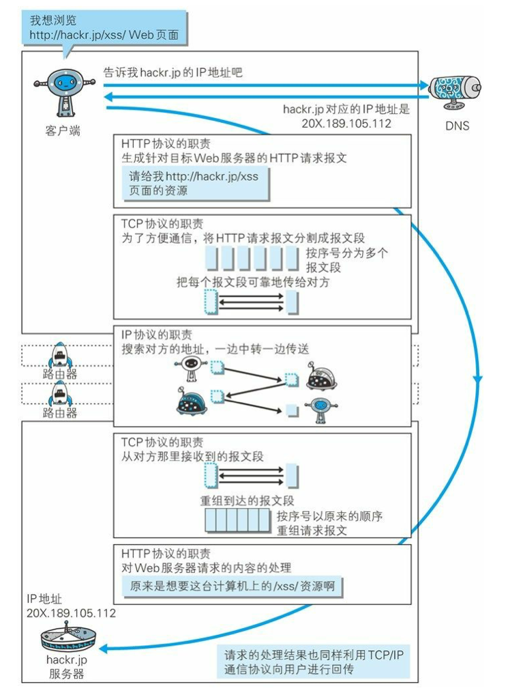
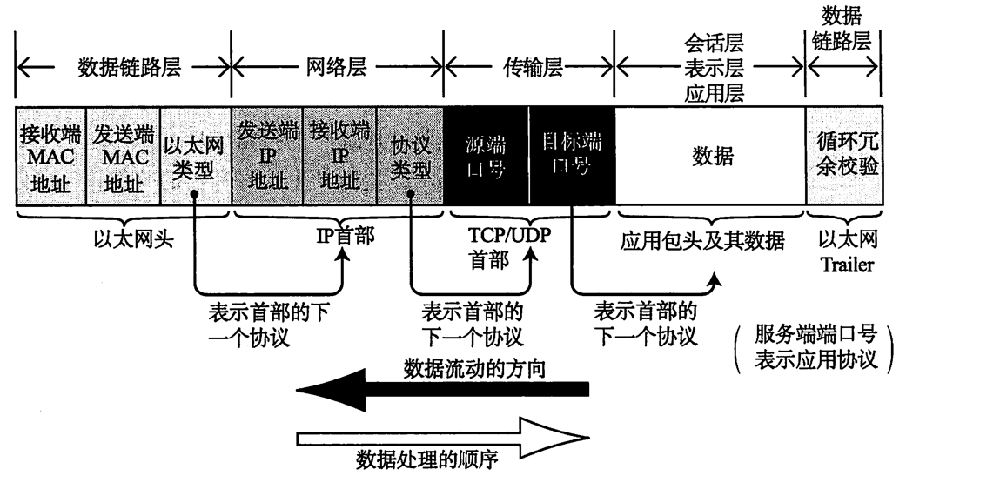

# 网络编程

这里以抽象化的一次网络请求来串联各个知识点。

## TCP/IP 协议簇

通常使用的网络是在TCP/IP协议簇的基础上运作的，TCP/IP包含两个核心协议：TCP(Transmission Control Protocol)和IP(Internet Protocol)，TCP/IP协议栈分为四个层次：

| TCP/IP协议栈 | 对应的协议                          | 作用                                                     |
| ------------ | ----------------------------------- | -------------------------------------------------------- |
| 应用层       | HTTP、DNS、SOCKS、RPC、TLS/SSL、SSH | 决定了向用户提供应用服务时通信的活动。                   |
| 传输层       | TCP、UDP                            | 对应用层提供处于网络连接中的两台计算机之间的数据传输协议 |
| 网络层       | IP/IPv6、ARP、RARP                  | 用来处理在网络上流动的数据包                             |
| 网络接口层   | 设备驱动程序及接口卡                | 用来处理连接网络的硬件部分。                             |

## 当用户在浏览器中输入网址后发生了什么

> 两台计算机之间的通信
>
> ​	用户在浏览器中输入某个网址，其目的是从目标网站中获取对应的页面资源，而目标网站的页面资源，最终是存储在某个实体计算机上的。也就是说，上述过程，其实是两台计算机之间通过TCP/IP协议簇进行通信的过程。
>
> ​	MAC地址标识不同的计算机，IP地址表示该计算机所处的子网的标识。
>
> ​	IP地址用于网络寻址，MAC地址用于硬件寻址，MAC地址无法更改，IP地址可以被动态分布。

### 浏览器解析URL

例如上图中所示，我们输入一个网址，定义了使用的应用层协议(http/s、ftp...)，然后浏览器对输入端URL进行解析、资源加载、URL转码等操作。

### DNS解析

DNS服务器用于将域名转换为对应的IP地址，通过DNS服务器的相应，发送端知道了目标服务器的IP地址。

~~得到目标服务器的IP地址后，通过ARP协议可以得到目标主机的MAC地址，这样，根据IP地址和MAC地址，发送方就知道了目标主机的位置，接下来就是请求目标主机获取对应的网页资源了。~~

### 确定发送目标

拿到目标服务器的IP地址后，根据ARP协议拿到目标服务器的MAC地址，以太网协议中规定：**同一局域网中的一台主机要和另一台主机进行直接通信，必须要知道目标主机的MAC地址。**

### 应用层协议

目标服务器的IP地址和MAC地址已经明确，接下来就是组装请求数据并通过网络发送给目标服务器了

+ 对于请求端

请求端将请求命令按照HTTP协议进行封装，生成HTTP请求报文，这样，数据来到了传输层。

~~~
[HTTP数据包]
~~~

+ 对于接收端

根据接收到的HTTP请求报文，找到对应的文件资源，返回给请求方。

### 传输层协议

+ 对于发送端

传输层协议的功能是建立端到端的通信，传输层会将应用层的请求报文添加TCP数据包标头(包括源端口号、目标端口号、包数据序号、校验信息)，此时的数据包格式变为(原始HTTP请求报文可能会被分割成多段)，TCP协议负责将这些数据包进行标号并可靠传递给接收方。

~~~
[TCP标头][HTTP数据包1]
[TCP标头][HTTP数据包2]
...
~~~

+ 对于接收端

首先对校验数据包是否损坏，然后根据包序号顺序接收，同时根据目标端口号确定数据最终发送给对应的应用程序。

### 网络层协议

传输层协议封装之后，数据明确了”端到端“的方向，然后IP协议将IP数据包嵌入，IP首部包含接收端IP地址以及发送端IP地址，紧随IP首部的还有用来判断其后面数据是TCP信息还是UDP信息：

~~~
[IP标头][TCP数据包1]
[IP标头][TCP数据包2]
...
~~~

网络层协议负责搜索对应的目标IP地址并将数据发送给对方

### 网络接口层协议

+ 对于请求方

对网络层传来的IP数据包添加以太网首部并通过网络硬件设备发送。以太网首部中包含接收端MAC地址、发送端MAC地址以及标志以太网类型的以太网数据协议

~~~
[以太网标头][IP标头][TCP数据包1]
[以太网标头][IP标头][TCP数据包2]
...
~~~

+ 对于接收方

主机接收到以太网包以后，首先从以太网的包首部找到MAC地址判断是否为发给自己的包，如果不是，则丢弃。

### 数据包结构

## 参考

《图解TCP IP》

《图解HTTP》

[互联网协议入门](http://www.ruanyifeng.com/blog/2012/05/internet_protocol_suite_part_i.html)

[网络请求过程扫盲](https://www.jianshu.com/p/8a40f99da882)

[从URL开始，定位世界](https://www.wangtianyi.top/blog/2017/10/22/cong-urlkai-shi-,ding-wei-shi-jie/?utm_source=github&utm_medium=github)