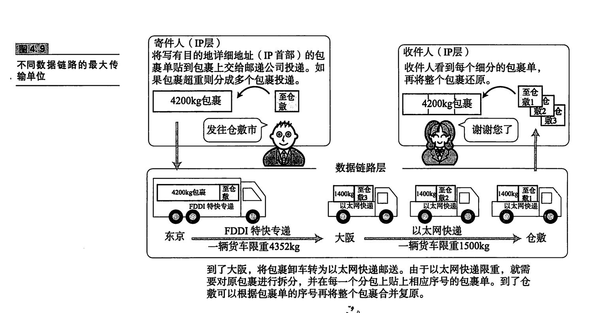

# 网络层协议

网络层的主要作用是实现”点对点通信“，网络层使用IP协议，IP协议基于IP地址转发分包数据。

互联网是由许多子网组合成的一个复杂网络模型，互联网中的主机，接入的是与其对应的子网。IP协议负责将不同的数据链路连接起来，以实现数据包的”点对点“传输。

例如从A地向B地运送一批货物，IP协议负责将这批货物选择以合适的交通工具，经过几次中转之后最终送达B地，期间的传递路径可能是

~~~
汽车->飞机->汽车->火车->汽车
~~~

IP协议负责选取合适的数据链路，并将其有序串联起来。

## IP属于面向无连接型

IP面向无连接，即在发包之前，不需要简历与端目标地址之间的连接。这样可以简化传输步骤，提升传输速度。

## 参考

《图解TCP IP》第四章