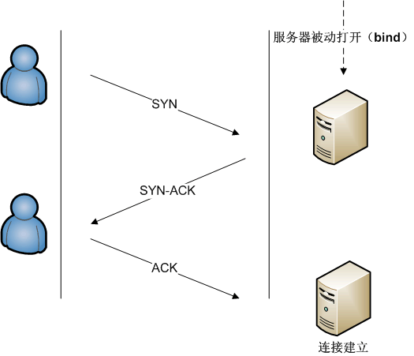

# 传输控制协议

传输控制协议(Transmission Control Protocol)是一种面向连接的、可靠的、基于字节流的传输层通信协议。TCP协议的运行可划分为三个阶段：连接创建(connection establishment)、数据传送(data transfer)、终止连接(connection termination)。

## TCP协议的运行过程

### 创建连接

TCP提供面向有连接的通信传输。面向有连接是指在数据通信开始之前先做好通信两端之间的准备工作。TCP通过三次握手过程创建一个连接。

+ 客户端向服务端发送一个`SYN`来发送连接请求，并设定一个随机数A来标记这次连接
+ 服务端对一个合法的`SYN`返回一个`SYN-ACK`来对此次连接请求应答，ACK的确认码应该是A+1，同时生成一个随机序号B，等待客户端的连接确认
+ 客户端接收到服务端的`SYN-ACK`之后，向服务端再发送一个值为B+1的`ACK`应答，此时，客户端与服务端成功建立了TCP连接，此次连接的包序号被设定为A+1

#### 为什么需要三次握手

TCP是一种全双工的通信方式，也就是说，客户端与服务端都需要具备发送和接收数据的能力：

+ 第一次握手，服务端明确了客户端的发送能力
+ 第二次握手，客户端明确了服务端的发送和接收能力
+ 第三次握手，服务端明确了客户端的接收能力

因此，三次握手，缺一不可，三次握手必须在一定时间内连贯执行，超出约定的时间，双方均认为此次连接失败。

### 数据传送

TCP需要保证数据传输的可靠性和强壮性。TCP协议使用以下方法保证数据包传输的可靠性：

#### 使用序号

当我们请求一个网页数据的时候，一个完整的页面数据可能会被分割成多个TCP包在传输层传输，每一段TCP报文段中都有一个序列号和确认号，序列号是当前包的序列标识，确认号是接收者对当前已接收到的TCP包序号向发送方的回应。

通过使用序号，TCP层可以把收到的报文段中的数据按正确的顺序交付给应用层；使用接收号，则使得接收方向发送方反馈已经成功接收的数据流的字节位置。

#### 报文检测及校验

每一个TCP报文段，都带有一个16位的校验码，用于对当前TCP报文段数据的校验，当使用对应的校验算法对TCP报文段的头部和数据部分计算出来的校验值与校验位的值不相等时，可以判断当前TCP报文段的数据不正确，接收端可以请求发送端重新发送该序号的数据包。

#### 流控制

用来处理”发快收慢“的情况，防止接收端重复触发重发机制。

#### 拥塞控制

在网络出现拥堵的情况下，发送方可以对所要发送的数据量进行调整。发送方和接收方根据确认包或者丢失包的情况、定时器等来估计网络拥堵的情况，从而对数据流大小进行修改。

#### 丢包重传

+ 基于重复累计确认的重传

接收方每收到一个包，就会向发送发反馈一个确认包以表示数据接收成功，当接收方对某个序号的包进行了3次确认时，发送方则认为该序号的包之后序列的包未能成功发送给接收方，进而重新发送。

+ 超时重传

发送方在固定时间内未收到接收方对某个数据包的确认时，则重新发送。

### 终止连接

TCP使用”四次挥手“的方式来终止连接，在此过程中，每一侧都独立地被终止。当一个端点要停止它这一侧的连接，就向对侧发送`FIN`，待收到对侧回复`ACK`确认时，则拆掉它这一侧的连接。由于TCP进行全双工通信，因此，对于每一侧来说，其实是都有两个连接。

+ A向B发送`FIN`主动关闭A->B的连接，此时A进入`FIN-WAIT-1`状态，等待B的响应，停止向B发送数据。

+ B收到对应的`FIN`后，向A发送确认报文`ACK`，确认可以拆除A->B的连接，同时B进入`CLOSE-WAIT`状态，准备关闭B->A的连接。同时A受到B的`ACK`之后，拆除A->B的连接，进入`FIN-TIME-2`的状态，等待B主动关闭B->A的连接。

+ 一段时间后，B向A发送一个`FIN`，进入`LAST-ACK`状态，等待A的响应

+ A收到B的`FIN`后向B发送`ACK`确认可以关闭B->A的连接，此时A会等待一段时间，再关闭连接，防止遗漏B发送来的数据，B收到A的响应后，关闭B->A的连接，不再向A发送数据。

  