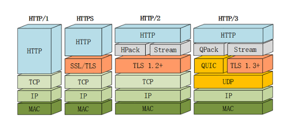

# HTTP

HTTP (Hyper Text Transfer Protocol，超文本传输协议)，是用于从万维网服务器传输超文本到本地浏览器的传送协议。HTTP是基于TCP/IP协议通信来传递数据（HTML文件、图片文件、查询结果等），是客户端与服务端之间请求和应答的标准。

## 版本进化

### HTTP/0.9

已过时，只接受GET请求，服务器只能回应HTML格式的字符串。

### HTTP/1.0

可以发送任何格式的内容：文字、图像、视频、二进制文件等

添加`POST`命令和`HEAD`命令

报文格式添加了多行请求头部分，用于描述客户端的情况。

+ 请求格式

~~~shell
GET / HTTP/1.0
User-Agent: ChromeXXXXXX
Accept: */*
~~~

+ 回应格式

~~~shell
HTTP/1.0 200 OK
Content-Type: text/plain
Content-Length: 137582
Expires: Thu, 05 Dec 1997 16:00:00 GMT
Last-Modified: Wed, 5 August 1996 15:55:28 GMT
Server: Apache 0.84

<html>
  <body>Hello World</body>
</html>
~~~

### HTTP/1.1

主要是引入了默认的持久连接，方便多个请求复用TCP连接，以及在数据传输效率方面的提升。

新增了`PUT`、`PATCH`、`HEAD`、`OPTIONS`、`DELETE`等方法

### HTTP/2

完全兼容HTTP/1，是”更安全的HTTP、更快的HTTPS“，头部压缩、多路复用等技术可以充分利用带宽，降低延迟，从而大幅度提高上网体验

### HTTP/3

基于UDP实现，吸取TCP协议的优点，实现了既快又可靠的数据传输。

## HTTP报文

用于HTTP协议交互的信息被称为HTTP报文，HTTP报文是由多行数据构成的字符串文本，其结构为：请求行 (request line) 、请求头 (header) 、空行、请求体。

**举例一个请求报文：**

## HTTP请求方法

+ GET：获取资源

GET方法用来请求访问已被URI识别的资源，指定的资源经服务器端解析后返回响应内容，如文本资源，程序的执行结果等。

~~~shell
请求：GET /index.html HTTP/1.1
响应：返回index.html的页面资源
~~~

+ POST：传输实体主体

向指定资源提交数据，请求服务器处理，数据被包含在请求文本中。

~~~
请求：POST /submit.cgi HTTP/1.1
	   Host: www.example.com
	   Content-Length: 1560
响应：返回submit.cgi接收数据的处理结果
~~~

+ PUT：传输文件

类FTP协议，向指定服务端请求上传文件，文件内容被包含在请求报文的主体中，由于HTTP/1.1自身不带验证机制，因此一般不使用。

+ HEAD：获得报文首部

与GET方法类似，但是不返回响应报文的主体部分。

+ DELETE：删除文件

与PUT方法相反

+ OPTIONS：询问支持的方法

用于查询请求URI指定的资源支持的方法

~~~
请求：OPTIONS * HTTP/1.1
		 Host: www.example.com
响应：HTTP/1.1 200 OK
	   Allow: GET,POST,HEAD,OPTIONS
~~~

+ TRACE：追踪路径

让Web服务器将之前的请求通信回环给客户端。

+ CONNECT：要求用隧道协议连接代理

主要是使用SSL和TLS协议把通信内容加密后经网络隧道传输

~~~
请求：CONNECT proxy.example.com:8080 HTTP/1.1
     Host: proxy.example.com
响应：HTTP/1.1 200 OK (之后进入隧道网络)
~~~

### GET方法与POST方法的区别

+ GET在浏览器回退是无害的，而POST会再次提交请求
+ GET请求会被浏览器主动缓存，而POST不会，除非手动设置
+ GET请求参数会被完整保留在浏览器历史记录里，而POST中的参数不会保留
+ GET请求在URL中传送的参数是有长度限制的，而POST没有限制
+ GET参数通过URL传递，POST放在Request Body中

## 状态码

| 状态码 | 类别         | 原因短语                   | 举例                                                         |
| ------ | ------------ | -------------------------- | ------------------------------------------------------------ |
| 1XX    | 信息性状态码 | 接收的请求正在处理         |                                                              |
| 2XX    | 成功状态码   | 请求正常处理完毕           | 200: 正常处理  204: 无资源可以返回 206: 客户端进行范围请求成功 |
| 3XX    | 重定向       | 需要进行附加操作以完成请求 | 301: 请求的资源已被分配了新的URI 302: 访问的资源被临时分配了新的URI 304: 资源已找到，但不符合请求时附加的条件 |
| 4XX    | 客户端错误   | 服务器无法处理请求         | 400: 请求报文中存在语法错误 401: 对请求的认证失败 403: 服务器拒绝访问被请求的资源 |
| 5XX    | 服务器错误   | 服务器处理请求出错         | 500: 服务器在执行请求时发生了错误 503: 服务器暂时处于超负荷或停机状态 |

## HTTP协议的特点

### 特点

+ 简单快速：只要使用对应的请求方法与资源路径，就可以确定资源
+ 灵活：可以传输任意类型的数据
+ 无连接
+ 无状态：每个请求都是独立的，方便更快地处理大量食物，确保HTTP协议的可伸缩性

### 缺点

+ 通信使用明文，内容可能会被窃听
+ 不验证通信方身份，因此有可能遭遇伪装
+ 无法证明报文的完整性，所以有可能已遭篡改

## 确保Web安全的HTTPS

结合SSL协议，来保证通信安全，HTTPS = HTTP over SSL

### HTTPS 工作流程

+ Client发起一个HTTPS的请求
+ Server把事先配置好的**公钥证书** (public key certificate) 返回给Client
+ Client对**公钥证书**进行验证：是否在有效期，是否在CRL吊销列表里等，如果验证不通过，显示警告信息
+ Client随机生成加密所使用的**会话秘钥**，然后用**公钥证书**提供的公钥加密这个**会话秘钥**，发送给Server
+ Server使用自己的私钥对解密得到**会话秘钥**
+ Server使用**会话秘钥**将待发送给Client的**明文内容**进行加密，发送给Client
+ Client使用**会话秘钥**解密后得到服务端发送的**明文内容**

## HTTP/2

请求和响应数据被分割为数据量更小的帧，并对其进行二进制编码

采用`HPACK`算法对Header进行压缩

引入多路复用技术，不再依赖TCP连接去实现多流合并，同域名只占用一个TCP连接，多帧之间可以乱序发送，根据帧首部的流标识进行重新组装。

使用TLS 1.2+对数据进行加密传递

## HTTP/3

HTTP/2可以看做是对HTTP 1.1协议的改进，但是由于其底层还是基于TCP进行传输，以及为了加密而引入的TLS，两个协议都存在握手过程，叠加起来的延时缺陷比较大，影响了服务器和客户端之间通信的效率。

HTTP/3是跑在QUIC上的HTTP

各版本的HTTP协议架构比较：

## 参考

[超文本传输协议]([https://zh.wikipedia.org/zh-cn/%E8%B6%85%E6%96%87%E6%9C%AC%E4%BC%A0%E8%BE%93%E5%8D%8F%E8%AE%AE#cite_note-ietf2616-1](https://zh.wikipedia.org/zh-cn/超文本传输协议#cite_note-ietf2616-1))

[HTTP协议入门](http://www.ruanyifeng.com/blog/2016/08/http.html)

[关于HTTP协议，需要知道的](https://github.com/ljianshu/Blog/issues/22)

[HTTPS工作流程](https://www.cnblogs.com/linianhui/p/security-https-workflow.html)