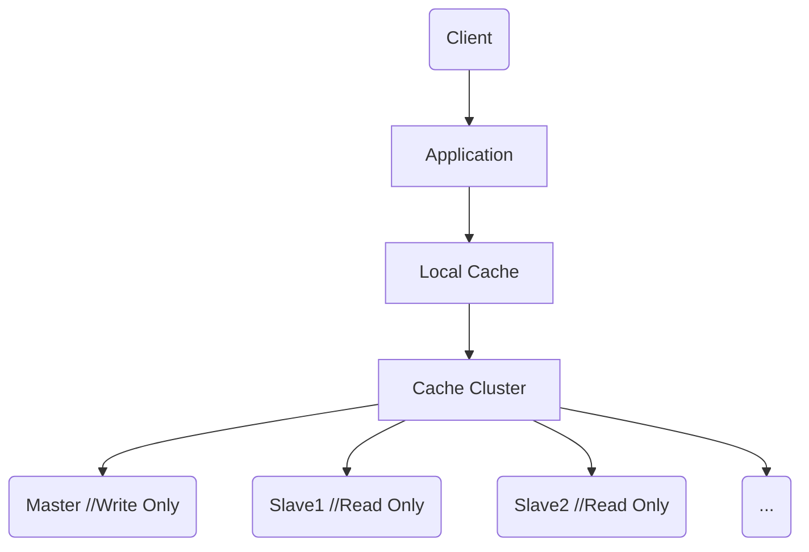

# 缓存

在高并发的场景下，大量的读写请求可能会超出数据库服务器的承载能力，导致业务服务出现性能瓶颈甚至系统由于超载而宕机。在应用层和数据库服务层引入缓存，将热点数据存储于缓存而减少对数据库层的io请求，可以有效地提高系统的响应速度，让有限的资源服务于更多的用户。

## 缓存的分类

缓存服务一般可以概括为以下三种类型：

### 1. 本地缓存

即在进程的内存中进行缓存

+ 优点

  应用服务与cache在同一个进程内部，请求响应速度非常快，没有过多的网络开销，适用于单机应用无集群需求的场景。

+ 缺点

  缓存与应用服务耦合度较高，且受限于单机容量，无法扩展

分布式架构中如果采用本地缓存机制，可以使用消息队列在各应用间进行数据一致性检查

### 2. 分布式缓存

即进程外缓存，应用服务与缓存服务进行分离，各应用共享同一个缓存服务，保证了数据一致性。

分布式缓存服务中，可以通过增加缓存节点来进行水平扩展，但是由于服务分离，需要进行远程请求。

### 3. 多级缓存

在整个系统架构的不同系统层级进行数据缓存，以提高访问效率。

## 缓存雪崩

Redis中的热点数据同一时间大面积失效，导致磁盘数据库在短时间内接收大量请求，可能导致该数据库服务宕机，从而影响相关服务宕机，引起连锁反应。

### 解决办法

+ 在设置key的过期时间时，加一个随机数
+ 集群情况下，将热点数据尽量均匀分布在不同的Redis节点中
+ 加锁队列
+ 熔断策略
+ 请求降级

例如扩大搜索范围返回数据。

## 缓存穿透

当外部服务请求一个缓存和数据库中都不存在的数据时，导致所有请求都落在数据库上，缓存服务对于不存在的数据形同虚设，被穿透。

### 解决办法

+ 布隆过滤器法

将所有可能存在的数据哈希到一个足够大的bitmap中，一个一定不存在的数据会被这个bitmap拦截雕，从而避免对底层存储系统的查询压力。

+ 接口层增加校验

如用户鉴权，参数校验等

+ 缓存和数据库中都不存在的数据，可以在缓存中将该key对应的值设置为null，并做短暂存储，当下次相同的请求过来时，可以在缓存中直接对该请求进行过滤

## 缓存击穿

缓存中不存在但数据库中存在的数据，当此时并发大量请求该数据时，使得数据库瞬间压力过大。

### 解决办法

+ 设置热点数据永不过期
+ 使用互斥锁

发现某个key不在缓存中时，争抢锁，抢到后查询数据库，查到数据放入缓存，并返回，释放锁。下次查询相同的key时，可以在缓存中直接查询到。

## 缓存预热

在系统上线后，将相关的缓存数据直接加载到缓存系统中。

数据量不大时，可以在服务启动时自动加载

也可以采用定时刷新缓存的策略

