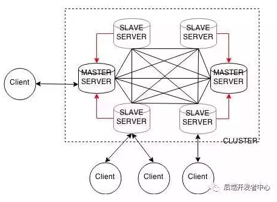

# 集群

Redis集群是Redis提供的分布式数据库方案，集群通过分片来进行数据共享，并提供复制和故障转移功能。Redis集群不支持处理多个key的命令，因为这需要在不同的节点间移动数据，影响Redis的性能。

## 需求

通常，为了提高网站的相应速度，总是把热点数据保存在内存中，而大型网站应用，热点数据往往体积巨大，几十G甚至上百G，这样就需要把这些热点数据分散到多个Redis中进行协同管理。

单个物理主机CPU往往是多核的，对于单线程工作模型的Redis，如果在一台物理主机上只运行一个Redis实例，则优点性能浪费，因此往往在单个物理主机上运行多个Redis实例。

## 分区 Partitioning

分区是将数据分割到多个Redis实例的处理过程，每个Redis实例只保存一个key的子集，这样多个Redis实例组成的一个Redis服务就可以使用所有机器的内存。Redis集群就是分区的一种实现。

## 分片 Sharding

分片是将一个数据分成两个或多个较小的块。例如一块很大的玻璃，被打碎后，每一个小碎片(shard)就是数据库的碎片，将整个数据库打碎的过程就叫做分片。

分片是一种将大数据分配到多个物理节点上的分区方案，属于横向扩展。

Redis集群通过分片的方式来保存数据库中的键值对：集群的整个数据库被分为16384个槽(slot)，数据库中的每个键都属于其中的一个槽。

### 节点数据库

当一个键值对数据被请求保存在Redis集群数据库中时，每个key通过CRC16校验后对16384取模来决定该键存储于哪个槽，根据节点记录的槽指派信息，决定该键值对数据最终存储于哪个节点中。

节点数据库使用跳表`slots_to_keys`来保存槽和键之间的关系。也就是说，一个槽会对应多个键值对。

## 集群方案

### 1. Redis Cluster

Redis 3.0开始支持redis-cluster集群，混合使用了`查询路由`和`客户端分区`的概念。

+ 一主多从，主节点挂掉后，从节点选举出新的主节点
+ 读写分离，Master负责写和同步给Slaver，Slaver承担被读的任务，因此可以通过增加Slaver节点的方式来提高并发读的能力
+ Master的写能力是瓶颈，同时Master有维护Slaver的开销

### 2. 代理中间件方案

客户端发送请求到代理服务器，代理服务解析客户端数据，并将请求转发至正确的节点，最后将结果回复给客户端，例如使用[tweproxy](https://github.com/twitter/twemproxy)。

或者使用[codis](https://github.com/CodisLabs/codis)。

### 3. 支持一致性哈希的客户端

如[redis-rb](https://github.com/redis/redis-rb)或者[Predis](https://github.com/nrk/predis)

## 参考

[数据库分片(Database Sharding)详解](https://zhuanlan.zhihu.com/p/57185574)

[MySQL分片、分区、分表、分库](https://blog.51cto.com/net881004/2109383)

[redis分区：如何在多个Redis实例之间拆分数据](https://jimolonely.github.io/2018/09/03/lang/009-redis-partition/)

[Codis集群的搭建与使用](https://www.cnblogs.com/xuanzhi201111/p/4425194.html)