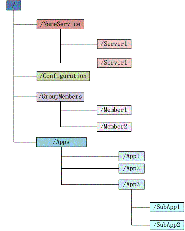

# Zookeeper

Zookeeper分布式服务框架是Apache Hadoop的一个子项目，主要用来解决分布式应用中经常遇到的一些数据管理问题：统一命名服务、状态同步服务、集群管理、分布式应用等。

## 内容

Zookeeper提供了什么？

简单的说，zookeeper = 文件系统 + 通知机制

### 文件系统

如上，每个子目录如`NameService`都被成为`znode`，可以像文件系统那样，自由地添加、删除`znode`。根据`znode`存储数据功能的不同，可以分为持久化类、临时类。

### 通知机制

客户端注册监听它关心的目录节点，当目录节点发生变化 (数据改变、节点被删除、子目录节点增、删)时，zookeeper会产生一个watcher事件，并且会通知到注册监听的客户端，但是客户端只会受到一次通知 (watcher是一次性的操作)。

## 角色

zookeeper中的角色主要分为三类

<table>
    <tr>
        <td colspan="2">角色</td> 
        <td>描述</td> 
   </tr>
   <tr>
        <td colspan="2">领导者 (Leader)</td> 
        <td>负责进行投票的发起和决议，更新系统状态</td> 
   </tr>
    <tr>
        <td rowspan="2">学习者 (Learner)</td>    
        <td >追随者 (Follower)</td>
      	<td>用于接收客户请求并向客户端返回结果，在选主过程中参与投票</td>
    </tr>
    <tr>
        <td >观察者 (Observer)</td>
      	<td>可以接收客户端连接，将写请求转发给leader节点，但Observer不参加投票过程，只同步leader的状态。Observer的目的是为了扩展系统，提高读取速度。</td>
    </tr>
  <tr>
        <td colspan="2">客户端 (Client)</td>
      	<td>请求发起方</td>
    </tr>
</table>

## 应用场景

### 配置管理

把分散的系统配置保存在zookeeper的某个结点中，然后所有相关应用程序对这个基点进行监听，一旦发生配置更改，每个应用程序即可收到zookeeper的通知。

### 集群管理与Master选举

集群的管理主要集中在两点：节点的增/删、选举master。

+ 所有节点可以配置在`GroupMember`目录下作为其子节点，子节点配置为临时目录，然后对父目录节点进行监听，就可以统一监听所有节点的变更。

+ 根据节点的序号顺序作为master节点的继承顺序

### 负载均衡

在分布式环境中，对多份相同功能服务进行负载均衡。如生产者/消费者、发布者/订阅者的负载均衡。

## 参考

[Zookeeper的原理和应用](https://www.jianshu.com/p/b8f509822c7b)